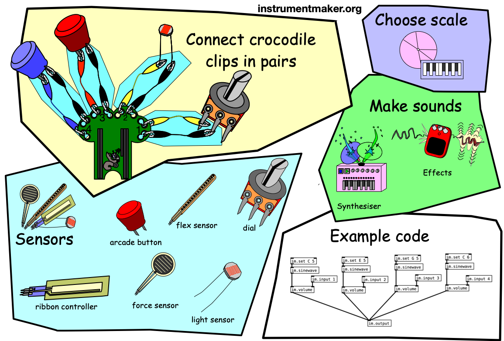

**Instrument Maker** is an open source framework for digital instrument building with sensors, for [Pure Data](http://puredata.info/) running on embedded computers such as [Bela](http://bela.io) or [Raspberry Pi](https://www.raspberrypi.org/) + [Arduino](https://www.arduino.cc/).  

<!--Some rough documentation is being generated here: <https://instrumentmaker.org/im-reference/>.-->

# Key pages:

- [**Learning Pd through Instrument Maker**](documentation/manual/learning-pd-through-im.md) (work in progress)
- [**GitHub repo**](https://github.com/matthewscharles/instrument-maker/)
- [**Instrument Maker Communication Symbols**](https://instrumentmaker.org/instrument-maker-symbols/)
- [**Wiki: development notes.**](https://github.com/matthewscharles/instrument-maker/wiki)  
  <!-- - **[Education Makers version](https://github.com/educationmakers/instrument-maker)** (development in an education technology context with Milieux Institute). -->

Distributed under the terms of the **GNU Public license version 3**.

The core code was developed by [Charles Matthews](http://ardisson.net/), initially through workshops in collaboration with [Gift Tshuma](http://www.utchoir.com/), and with more in the pipeline through our project [Blurring the Boundaries](http://www.blurringtheboundaries.org/).  

<!--Thanks to [Roybn Steward](https://www.robynsteward.com/music), [Education Makers](http://www.educationmakers.ca/), and [Dave Darch](http://alittlelearning.org/) (+ many more) for testing the code and helping generate documentation.-->

---

Read about the philosophy behind this framework on the [Bela.io blog](https://blog.bela.io/2019/08/20/towards-disabled-artist-led-music-technology-charles-matthews/).

---

---

# How does it work?

Although Instrument Maker was designed as a complete workshop package, the main resource is a library of objects for [Pure Data](http://puredata.info/) that can be used independently.

Having downloaded the library, create and connect building blocks in the form of obects with the `im.` prefix: e.g. inputs, outputs, tuning systems, processors, and synthesisers. 

Upload this code to Bela, or use a Raspberry Pi with an Arduino-type device connected.  

----

# Installation

*This is for our current demo setup for desktops/RPi. Deken release and instructions for Bela coming soon!*

We recommend using [Patchbox OS](https://blokas.io/patchbox-os/) for Raspberry Pi.

## **Recommended: clone this repo**

Clone the repo to a local folder using terminal:
- `git clone https://github.com/matthewscharles/instrument-maker`
  - *On a Mac, you might be required to download developer tools. There is no need to install Xcode if prompted.*
- Keep up to date by periodically typing `git pull` within the folder in terminal.

## **Alternative: direct download**

Click the green Clone or Download icon at the top of the [GitHub repo](https://github.com/matthewscharles/instrument-maker) to download a zip file.  If you choose this option, you will need to download updates manually in the future.

## **Installation**

- Install [Pure Data](http://puredata.info/downloads)

  - *On a Mac, you may need to right-click on the downloaded application to open it.*

- Add the instrument-maker folder to the search path in Pure Data: 

  - from the `pd` menu (next to `file`), choose `preferences` > `path`
  - click `new` 
  - browse to the folder you cloned to.

  

  

- Find a list of objects by opening `_im-object-overview.pd` from the main folder

- Right-click on the objects found here to open help files. 

  

Testing

